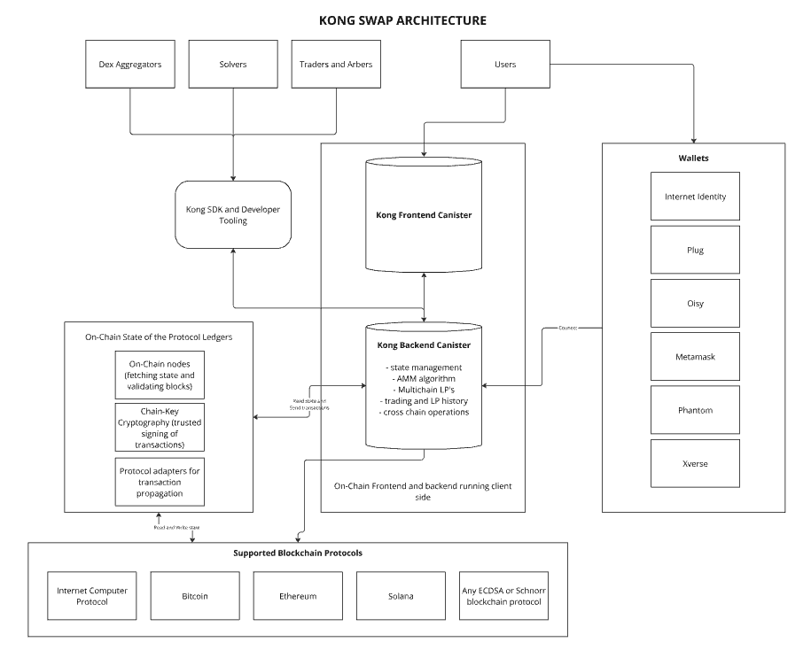

# KongSwap Whitepaper

## Summary

KongSwap goes beyond being just a DEX; it’s a transcending platform that addresses key challenges in DeFi, including fragmentation of liquidity, scalability, state management, and seamless cross-chain interoperability. Our innovative technology ensures users can engage with DeFi without the complexities of underlying protocols, creating a streamlined and efficient experience across multiple blockchains.

By developing the frontend and backend into smart contracts that execute entirely on-chain, KongSwap achieves a high level of decentralization, security, and efficiency. The use of threshold cryptography further enhances our capability to operate across multiple blockchains, making it a robust platform for the future of DeFi.

This innovation in DeFi will enable a seamless cross-chain user experience and re-imagines how liquidity is allocated and traded across multiple ecosystems.

## How is KongSwap Different from other DEXes

Despite the large number of decentralized exchanges (DEXs) in crypto, there is a need for a DEX that will address key DeFi challenges such as liquidity fragmentation, high gas fees, scalability limitations, and complex user experiences. Existing DEXs often operate within isolated blockchain ecosystems, requiring users to navigate multiple platforms and deal with interoperability issues when trading across different chains. This fragmentation not only increases transaction costs and time but also exposes users to additional risks associated with external bridges and wrapped tokens.

KongSwap emerges as a platform that addresses these shortcomings by offering seamless, bridgeless cross-chain interoperability, enabling users to trade native assets across multiple blockchains from a single, user-friendly platform. By leveraging advanced technologies like stable memory and operating entirely on-chain through the Internet Computer Protocol (ICP), KongSwap reduces transaction costs, enhances scalability, and simplifies DeFi interactions, making DeFi more accessible and efficient for a broader audience across multiple blockchain ecosystems.

## Chain Fusion - The Future of DeFi is Multichain

KongSwap utilizes Chain Fusion technology to achieve true cross-chain interoperability without relying on external bridges or intermediaries. By building on the capabilities of the Internet Computer Protocol’s Chain Fusion, KongSwap can natively integrate with multiple blockchain networks at the protocol level. This integration allows for direct communication and transactions between different blockchains, enabling users to seamlessly trade, lend, and borrow assets across various ecosystems in a secure and efficient manner. The initial integrations will include native Bitcoin, Ethereum, and Solana.

Chain Fusion technology enables the aggregation of liquidity from multiple chains, reducing fragmentation and improving trading efficiency. It also supports the execution of complex smart contracts and the storage of large datasets on-chain, enhancing the platform’s ability to offer advanced DeFi services. Through Chain Fusion, KongSwap delivers a robust, scalable, and user-centric platform that transcends the limitations of traditional DEXs, providing unparalleled access and functionality in the decentralized finance landscape.

## Purpose of the SNS Launch

The SNS launch will transition KongSwap from a developer-controlled project to a fully decentralized DAO, with the $KONG token as the primary utility and governance token. This event is intended to align incentives among users, developers, and investors, with the aim of fostering long-term success.

## Product Overview

What sets KongSwap apart is not just its ability to store more data in smart contracts but how it utilizes that storage to enable real-time, complex, and secure transactions of blockchain assets and manage interactions with other smart contract platforms. This means that KongSwap isn’t just another trading platform—it’s a fully integrated DeFi ecosystem. Every aspect of a user’s interaction with DeFi can be seamlessly handled directly on-chain, bringing unprecedented efficiency and security.

### Key Features

- **Enhanced Scalability and State Management**: KongSwap utilizes stable memory, enabling smart contracts to maintain large states (up to 400GB) without constant updates or upgrade snapshots. This innovation allows KongSwap to store vast amounts of historical data directly within contracts, facilitating advanced trading algorithms and prediction models without relying on external oracles.

- **Seamless Cross-Chain and Interoperability**: KongSwap facilitates bridgeless DeFi with native assets, streamlining cross-chain swaps, lending, and other DeFi interactions. This approach simplifies the user experience, enabling seamless trading, borrowing, and lending regardless of the blockchain in use.

- **User Experience and Interaction**:
  - *Personalized Trading Experience*: KongSwap can store user preferences, trading history, and personalized algorithms directly within the platform, offering a highly tailored trading experience.
  - *Atomic Operations*: Stable memory ensures operations are atomic across large datasets, minimizing the risk of partial failures in complex transactions, which is essential for maintaining security and reliability in DeFi.

### Enhanced DeFi Primitives

- **Yield Farming and Staking**: KongSwap’s stable memory enables sophisticated yield farming strategies, where the state of multiple farms or staking positions can be tracked and adjusted in real-time, all within a single contract.
- **Derivatives and Options**: The platform supports the creation of complex financial derivatives on-chain, allowing contracts to reflect crucial metrics like price history and volatility for accurate pricing.

### Security and Immutability

- **Immutable Audit Trails**: KongSwap’s ability to store vast amounts of data immutably enhances transparency and auditability. Every action, from liquidity provision to trading, is logged in detail, reducing fraud and building trust.
- **Resilience to Upgrades**: The platform ensures that critical data remains intact during smart contract upgrades, maintaining trust and security in AMM DEXes where liquidity and user funds are at stake.

## Technical Architecture

KongSwap is an innovative DEX built on the Internet Computer Protocol, utilizing stable memory within the canister smart contracts to manage all state and operations. The architecture is designed for efficiency, scalability, and cross-chain interoperability, leveraging advanced cryptographic techniques and the unique capabilities of the ICP.

### Key Components

#### Kong Frontend Canister (`kingkong_frontend`)

This canister hosts the user interface of KongSwap, developed with React and JavaScript. It handles all user interactions, including initiating trades, adding or removing liquidity, staking in pools, and viewing transaction histories. The frontend canister communicates with the backend canister to execute these operations securely.

#### Kong Backend Canister (`kingkong_backend`)

The backend canister is the core component of KongSwap, written in Rust. It manages the stable memory and business logic required to operate the liquidity pools, process trades, manage staking, and maintain the state of user accounts and tokens.

#### Liquidity Pools

The liquidity pools are the backbone of the KongSwap DEX. Each liquidity pool is represented within the backend canister as a `StablePool` structure, which tracks the token pairs, pool balances, fees, and transaction history. Users provide liquidity by depositing token pairs, receiving LP tokens in return.

#### Staking Pools

The staking pools allow users to stake their LP tokens to earn additional rewards, which are distributed based on DAO governance. The more LP tokens a user stakes and the longer they are staked, the higher the potential rewards. The staking pools are managed within the backend canister, which tracks the staking activity and ensures rewards are distributed according to community decisions.

### Component Features

#### DEX in Stable Memory

- **Stable Memory Utilization**: All the state related to liquidity pools, swaps, and liquidity management is maintained in stable memory, ensuring that the DEX can handle vast amounts of data without the need for constant snapshots or upgrades.
- **State Management**: The DEX operates by managing all liquidity pool states in stable memory. This includes tracking individual liquidity positions, swap transactions, and adding or removing liquidity.

#### Single Canister Architecture

- **Single Canister DEX**: KongSwap backend operates within a single canister smart contract, which handles the entire state of the DEX, including all liquidity pools and user transactions. This unified approach simplifies the architecture, reduces the overhead of managing multiple contracts, and ensures that all operations are tightly integrated and consistent.

- **Liquidity Pools as Positions**: Unlike traditional DEXes where liquidity pools are represented by tokens (e.g., LP tokens), in KongSwap, liquidity pools are managed as positions directly within stable memory. Each position is a data structure stored in stable memory, tracking the amount of liquidity provided, the corresponding share of the pool, and other relevant metadata.

#### Multichain Pools with Advanced Cryptography

- **Threshold ECDSA and Schnorr Signatures**: KongSwap utilizes threshold ECDSA and Schnorr signatures to create and manage multichain pools. These cryptographic techniques enable the DEX to sign transactions across multiple blockchains securely and efficiently, facilitating cross-chain swaps and liquidity management without requiring traditional bridging mechanisms.

- **Cross-Chain Interoperability**: The use of threshold cryptography allows KongSwap to support native assets from various blockchains (e.g., Bitcoin, Ethereum) within the same liquidity pools.

#### Fully On-Chain Backend and Frontend

- **On-Chain Backend**: The backend of KongSwap, responsible for processing transactions, managing liquidity, and executing swaps, runs entirely within the canister smart contract.
- **On-Chain Frontend**: In addition to the backend, the frontend of KongSwap is also hosted on-chain within the canister. This includes the user interface code, which users interact with through their wallets.

#### Direct Wallet Integration

- **Direct Connection to Kong Canister**: User wallets connect directly to the Kong canister smart contract, enabling seamless interaction with the DEX.
- **On-Chain Operations**: All interactions, including those initiated by wallets, are processed entirely within the canister, ensuring that both the backend logic and the user interface are fully decentralized and on-chain.

### Transaction Flow and Logic

#### Adding Liquidity

Users can add liquidity to the pools by depositing token pairs. The system calculates the amounts required, updates the pool state, and issues liquidity pool (LP) tokens to the user. These LP tokens can then be staked in the staking pools to earn additional rewards.

#### Staking LP Tokens

After receiving LP tokens, users can choose to stake them in the staking pools. By doing so, they become eligible to receive extra rewards distributed based on the amount of tokens staked and the duration of staking. The DAO determines how rewards are allocated across different pools through community voting.

#### Removing Liquidity

When users remove liquidity, the system calculates the proportionate amounts of the token pairs to be returned, updates the pool balances, and burns the corresponding LP tokens.

#### Token Swaps

Token swaps are executed through a series of well-defined steps:

1. **Pre-swap Checks**: Initial validations are performed to ensure the availability of sufficient liquidity and valid user balances.
2. **Swap Execution**: The system calculates the output amounts, updates the pool states, and processes the token transfers.
3. **Post-swap Validation**: After the swap, the system verifies the final state of the canisters to ensure consistency and accuracy. Any discrepancies trigger rollback mechanisms, safeguarding user funds.

#### Claims Handling

In cases where a transaction fails or an airdrop is issued, the backend canister creates a `StableClaim` entry. Users can later claim their tokens through the claims API, ensuring that no funds are lost due to temporary issues.

### Security and Reliability

KongSwap's architecture is built with security and reliability in mind. The use of stable memory ensures data persistence across canisters, while the separation of frontend and backend logic provides a clear demarcation of responsibilities. By following a strict transaction flow and incorporating rollback mechanisms, the platform minimizes the risk of errors and race conditions, making it a robust and trustworthy DEX solution on the Internet Computer.

## Fee & Reward System

### Swap Fees

KongSwap has a trading fee for swaps executed via its canister. This fee typically ranges from 0.15% to 0.30%, depending on the pool (stable coin pools 0.15%, all other pools 0.30%). The fee structure is designed to minimize costs for users while maintaining enough incentive for liquidity providers.

### Fee Distribution

The trading fee is allocated to liquidity providers (LPs) in the form of trading fees. This is distributed proportionally to their share in the liquidity pool.

### Kong Rewards System

KongSwap’s rewards system is designed to incentivize liquidity provision and active participation in platform governance. By requiring liquidity providers to stake their tokens to earn $KONG rewards and enabling $KONG token holders to vote on reward distribution, the system aligns the interests of all participants. This approach fosters a robust and engaged community, ensuring that the platform’s growth is both sustainable and community-driven.

#### Liquidity Provision and Staking - Staking for Rewards

- **Liquidity Providers (LPs)**: Users who supply tokens to KongSwap’s liquidity pools receive liquidity pool (LP) tokens representing their share in the pool.
- **Staking Requirement**: To be eligible for $KONG token rewards, LPs must stake their LP tokens in the designated staking contracts on the platform.
- **Earning Rewards**: Once staked, LPs begin to accumulate $KONG rewards proportionally based on the amount of liquidity provided and the duration of staking.
- **Boosted Rewards**: LPs can enhance their reward rate by locking their staked LP tokens for longer periods, encouraging long-term commitment to the platform.

#### Voting Mechanism

- **Bi-Weekly Voting Cycle**: Every two weeks, $KONG token holders are invited to participate in a governance vote to determine the allocation of $KONG rewards across different liquidity pools.
- **Voting Power**: The voting power of each participant is proportional to the amount of $KONG tokens they hold or have staked, incentivizing users to acquire and hold $KONG tokens.
- **Decision Making**: Through this democratic process, the community can influence which pools receive more rewards, effectively directing liquidity to where it’s most needed.

#### Governance Participation

- **Proposal Submission**: $KONG token holders can submit proposals for new pools or changes to existing reward allocations.
- **Transparency and Security**: All votes and proposals are recorded on-chain, ensuring transparency and integrity in the governance process.

## Team

KongSwap is developed by experienced developers with expertise in blockchain development, traditional finance, and ecosystem development. The team’s combined experience includes roles and successful projects within major organizations such as Sygnum Bank, UBS, Deutsche Bank, DFINITY, and others. Our diverse backgrounds in building on blockchains like Ethereum and the Internet Computer Protocol, including projects like Helix Markets, equip us with the knowledge and skills necessary to drive innovation and deliver a cutting-edge DeFi platform.

The KongSwap team is uniquely positioned to deliver a platform that not only meets the current demands of the DeFi market but also anticipates future trends and challenges. Their combined experiences underscore their capability to execute ambitious goals and contribute meaningfully to the decentralized finance landscape.

## Goals of the SNS Launch

### Decentralization of Governance

The primary goal of the SNS launch is to decentralize governance, placing control of KongSwap into the hands of its users. This is achieved by introducing the $KONG token, which will be used to vote on proposals, manage the treasury, and guide the future direction of the platform.

### Community Empowerment

By distributing $KONG tokens to a broad base of users, KongSwap ensures that its future is determined by a diverse and active community. This decentralization is expected to lead to a more resilient and innovative platform.

### Sustainability and Growth

The SNS will provide the necessary funding to continue the development of KongSwap, with a portion of $KONG tokens allocated to a treasury controlled by the community. This will support ongoing improvements, marketing, and user acquisition efforts.

## Tokenomics

### $KONG Token Overview

- **Ticker**: $KONG
- **Total Supply**: 1,000,000,000 tokens

#### Utility

- **Governance**: $KONG holders can vote on key decisions such as feature development, fee structures, and partnerships.
- **Staking and Rewards Voting**: Besides the protocol governance, $KONG tokens can be used to vote on the distribution of $KONG token rewards across different pools on KongSwap.

Liquidity providers who stake their LP positions for a specified period will receive $KONG rewards in proportion to how liquidity rewards are allocated. This mechanism incentivizes long-term commitment and active participation in the ecosystem, aligning user interests with the platform’s growth and stability.

### Initial Allocation

- **Community Rewards**:
  - *DAO Treasury*: 60% - Managed by the community for development, growth initiatives, and liquidity rewards distribution.
  - From the total, we would like to allocate 25% to liquidity provider rewards and incentivization of trading on KongSwap. 1% will be allocated as an airdrop to early liquidity providers that will provide liquidity on the platform prior to the SNS sale.

- **Decentralization Swap**: 20% - Distributed to the community through the SNS.
- **Development Team**: 20% - Dissolve over two years to ensure continued commitment.

## Roadmap

### Q3 2024

- Core platform launch - Completed
- Mobile version - Completed
- SDK & Developer Tooling - Completed

### Q4 2024

- Staking pools
- Multi-chain pools
- Wallet Integrations
- Integrations with DEX aggregators and AMM liquidity providers

### Q1 2025

- Limit orders
- Solver Integrations
- Concentrated Liquidity

### Q2 2025

- Lending Markets
- Margin trading